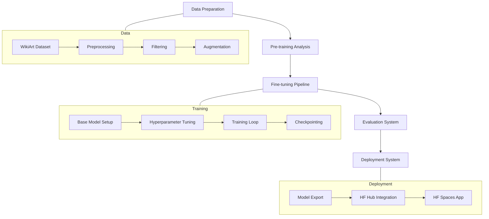

# System Patterns: Flux Impressionism Fine-Tuning

## System Architecture
The project follows a modular architecture with distinct components for each phase of the fine-tuning process:

## Key Technical Decisions
1. **Base Model Selection**: Flux.1 Dev chosen for its balance of quality and efficiency
2. **Fine-tuning Approach**: LoRA (Low-Rank Adaptation) for efficient adaptation
3. **Training Environment**: Google Colab Pro for GPU acceleration
4. **Data Processing**: WikiArt dataset filtered to Impressionism subset with potential augmentation
5. **Deployment Strategy**: Hugging Face Hub for model hosting and Spaces for demo interface

## Design Patterns in Use
1. **Pipeline Pattern**: Sequential processing of data through distinct stages
2. **Repository Pattern**: Centralized management of model versions and checkpoints
3. **Observer Pattern**: Monitoring training progress and metrics
4. **Strategy Pattern**: Flexible approach to hyperparameter tuning
5. **Factory Pattern**: Standardized generation of sample images for evaluation

## Component Relationships
- **Data Preparation → Fine-tuning**: Clean, processed data feeds into the training pipeline
- **Fine-tuning → Evaluation**: Trained models undergo systematic evaluation
- **Evaluation → Deployment**: Only models meeting quality thresholds proceed to deployment
- **Documentation → All Components**: Comprehensive documentation integrates with all project aspects

## Technical Constraints
1. Limited by Google Colab Pro GPU resources and runtime
2. Dependent on Hugging Face ecosystem for deployment
3. Model size restrictions for efficient serving
4. Balance between fine-tuning depth and risk of overfitting 